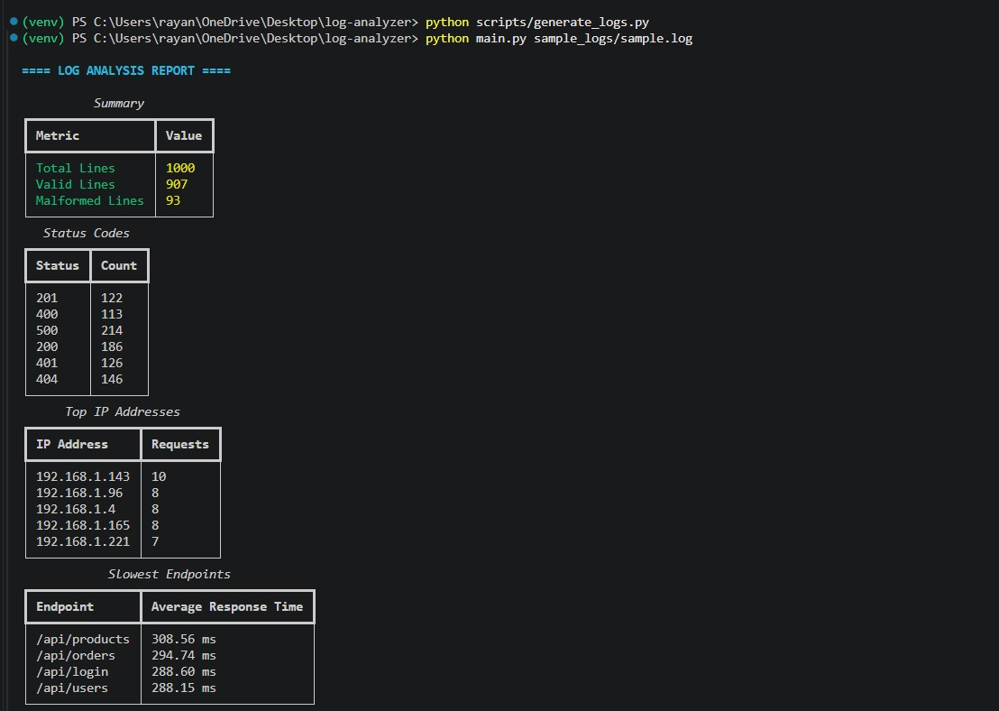

# Robust Log Analyzer CLI

A resilient Python-based command-line log analysis tool designed to process large and inconsistent server log files while gracefully handling malformed data, mixed formats, and unexpected input.

The analyzer generates operational insights such as status code distributions, top IP addresses, slowest endpoints, and malformed log statistics without crashing on corrupted entries.

---

## Features

- Parses traditional server log formats
- Supports JSON-formatted log entries
- Handles multiple timestamp formats:
  - ISO 8601
  - Slash-separated dates
  - Textual month formats
  - Unix epoch timestamps
- Normalizes response times:
  - `142ms`
  - `0.142s`
  - raw numeric values
- Gracefully skips malformed or partial log entries
- Tracks malformed/anomalous lines separately
- Processes mixed-format log files safely
- Generates operational summaries and endpoint statistics
- Uses rich terminal tables for clean CLI output

---

## Sample Output



---

## Project Structure

```text
log-analyzer/
│
├── analyzer/
│   ├── __init__.py
│   ├── analyzer.py
│   ├── models.py
│   ├── parser.py
│   └── utils.py
│
├── assets/
│   └── image.png
│
├── scripts/
│   └── generate_logs.py
│
├── sample_logs/
│   └── sample.log
│
├── main.py
├── README.md
├── ANSWERS.md
├── requirements.txt
└── .gitignore
```

---

## Installation

### 1. Clone the Repository

```bash
git clone https://github.com/nayar-900/robust-log-analyzer-cli
cd log-analyzer
```

---

### 2. Create Virtual Environment

#### Windows

```bash
python -m venv venv
venv\Scripts\activate
```

#### Linux / macOS

```bash
python3 -m venv venv
source venv/bin/activate
```

---

### 3. Install Dependencies

```bash
pip install -r requirements.txt
```

---

## Generate Sample Logs

The repository includes a development log generator that creates realistic mixed-format log files containing:

- Valid log entries
- JSON log entries
- Malformed lines
- Partial writes
- Mixed response time formats

Run:

```bash
python scripts/generate_logs.py
```

Generated file:

```text
sample_logs/sample.log
```

---

## Run the Analyzer

```bash
python main.py sample_logs/sample.log
```

---

## Example Analysis Performed

The analyzer reports:

- Total processed lines
- Valid entries
- Malformed entries
- Status code distribution
- Most frequent IP addresses
- Slowest endpoints by average response time

---

## Design Philosophy

This project prioritizes resilience and graceful degradation over strict assumptions about log structure.

Real-world logs are often inconsistent due to:
- malformed writes
- partial stack traces
- mixed logging systems
- changing formats over time

Instead of crashing or silently discarding invalid data, the analyzer:
- continues processing safely
- tracks malformed lines explicitly
- surfaces anomalies in the final report

---

## Technologies Used

- Python 3
- Rich (terminal formatting)
- argparse
- regex
- dataclasses
- collections

---

## Running on a Fresh Machine

Install dependencies:

```bash
pip install -r requirements.txt
```

Generate sample logs:

```bash
python scripts/generate_logs.py
```

Run analyzer:

```bash
python main.py sample_logs/sample.log
```

---

## Notes

This project was intentionally implemented as a lightweight CLI application to focus on:
- robust parsing
- malformed input handling
- operational analysis
- maintainable architecture

rather than unnecessary frontend or infrastructure complexity.